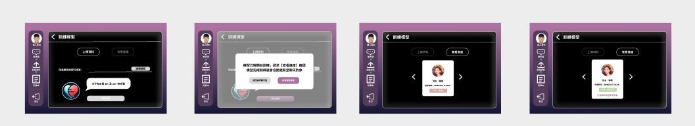
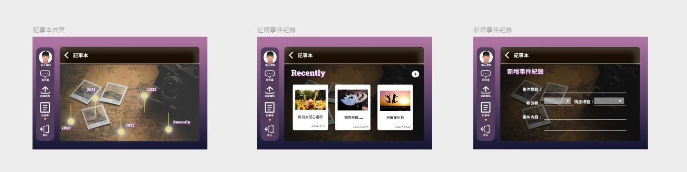
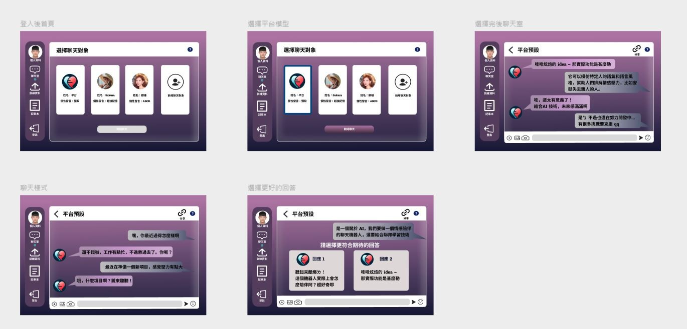
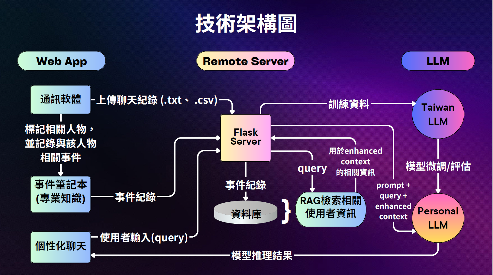
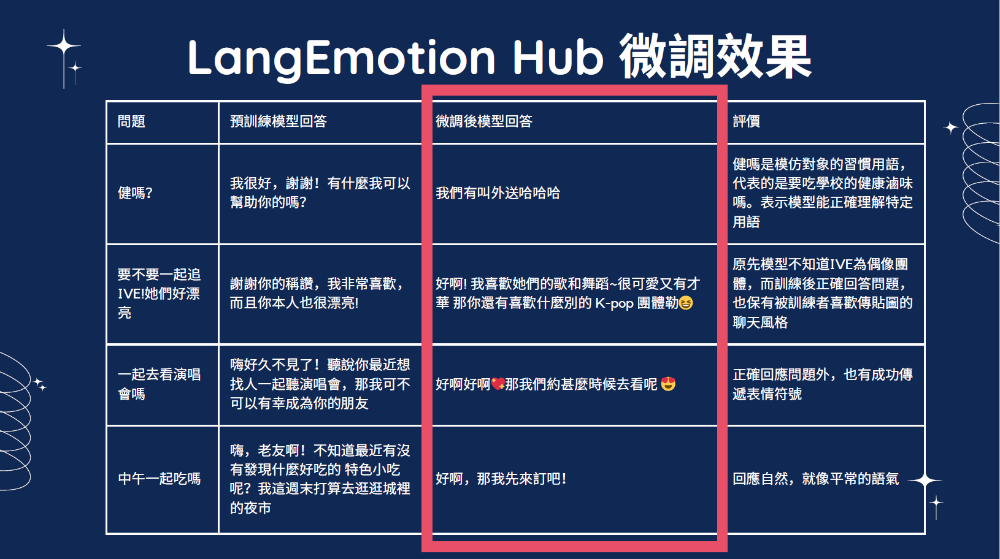

# LangEmotionHub 智慧語言模型訓練平台

LangEmotionHub 是一個提供情感支持與陪伴的智能平台。透過模擬指定對象的語言風格，幫助使用者重溫與親友的對話，實現心理安慰與情感連結。同時支援長者智慧傳承、防止失智與娛樂功能，提升使用者生活品質。

## 🌟 專案亮點
- 模仿指定對象語言風格，重現與親友的對話情感
- 事件記事本結合 RAG 技術，提供更精準的情境回應
- 個性化聊天模型，可隨互動學習與適應使用者語氣
- 支援聯邦式學習，確保個人資料安全
- RWD 設計，可在桌面、筆電與手機上使用

## 功能介紹

### 1. 指定對象模仿
- 上傳聊天紀錄微調模型 (Fine-tuning)
- 模擬指定對象的語氣與風格
- 保存長者智慧與回憶，延續情感連結

### 2. 事件記事本
- 記錄使用者事件資料
- 運用 RAG 技術增強對話理解
- 提高互動準確性與深度

### 3. 個性化聊天模型
- 模型會隨互動學習使用者語氣
- 支援使用者評估調整模型表現
- 可分享模型給親友或保存作為替身

## 技術架構

1. **Web App**
   - 上傳聊天紀錄並進行模型微調
   - 多場景事件管理，搭配 RAG 技術提供生成推理

2. **Remote Server**
   - Flask 提供微調與推理 API
   - 高效能伺服器支援個人陪伴與商業應用

3. **Taiwan LLM 中文化模型**
   - 使用本地新聞、小說、社群文本進行訓練
   - 改善中文理解能力與回應自然度
   - 微調流程：
     1. 資料預處理：聊天紀錄轉 CSV，分詞並轉 token
     2. 模型量化：BitsAndBytes 4-bit，降低 RAM 需求
     3. LoRa 微調：自監督 Parameter Efficient Fine-tuning
     

## 使用成果
- 模型能精準回應問題，模擬指定對象語氣與風格
- 支援 RWD，桌面、筆電、手機均可使用
- 提供靈活操作環境，可選擇聯邦式學習
- 適用於個人情感陪伴及商業場景
